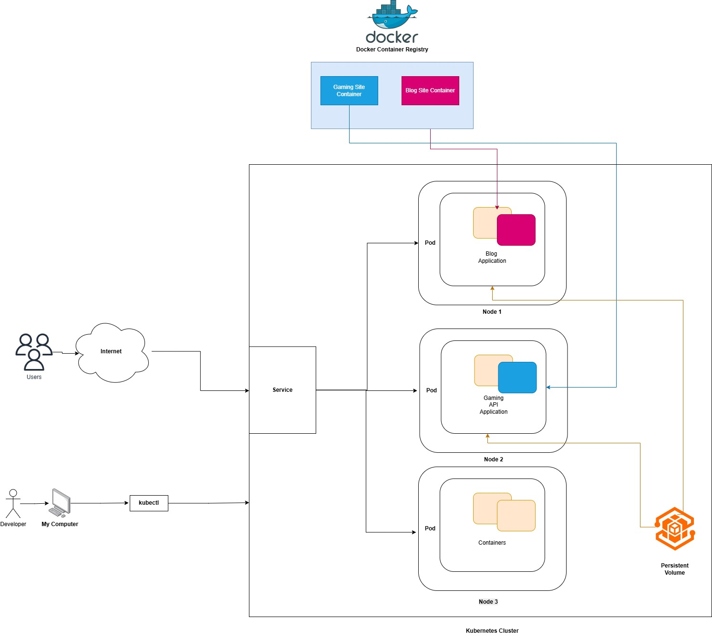

# DevOps with Docker

This repository contains my work and notes for the [DevOps with Docker](https://devopswithdocker.com/) course by the University of Helsinki.

## Course Structure

### Chapter 2: Docker and Development
- [Getting Started](chapter-2/getting-started/)
- [In-depth Dive into Images](chapter-2/in-depth-dive-into-images/)
- [Interacting with Containers via Volumes and Ports](chapter-2/interacting-with-the-container-via-volumes-and-ports/)
- [Running and Stopping Containers](chapter-2/running-and-stopping-containers/)
- [Utilizing Tools from the Registry](chapter-2/utilizing-tools-from-the-registry/)
  - [Hello Backend](chapter-2/utilizing-tools-from-the-registry/hello-backend/)
  - [Hello Frontend](chapter-2/utilizing-tools-from-the-registry/hello-frontend/)
  - [Spring Example Project](chapter-2/utilizing-tools-from-the-registry/spring-example-project/)

### Chapter 3: Docker Compose
- [Containers in Development](chapter-3/containers-in-development/)
- [Docker Networking](chapter-3/docker-networking/)
- [Migrating to Docker Compose](chapter-3/migrating-to-docker-compose/)
- [Volumes in Action](chapter-3/volumes-in-action/)

### Chapter 4: Security and Optimization
- [Deployment Pipelines](chapter-4/deployment-pipelines/)
- [Multi-Host Environments](chapter-4/multi-host-environments/)
- [Optimizing the Image Size](chapter-4/optimizing-the-image-size/)
- [Using a Non-Root User](chapter-4/using-a-non-root-user/)

## Multi-Host Environments

## Resources
- Official course website: [DevOps with Docker](https://devopswithdocker.com/)
- Docker documentation: [https://docs.docker.com/](https://docs.docker.com/)
